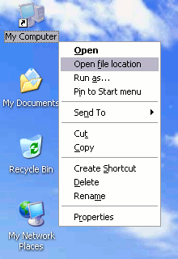



## OpenFileLocation vbs\+vbp

### Description

Provides functionality similar to Windows Vista & 7's "Open file location"

context menu for pre-Vista OSes. In Vista & 7, shortcut files have a handy

context menu option, that upon clicking, pre-selects that shortcut's target in

a new Explorer window. Requires an enabled Microsoft Windows Script Host

(wscript.exe). Open it once to install or uninstall.

Updated on 2/3/12 to include a VB6 port. The compiled version performs quicker

and takes care of installing/uninstalling itself.

 
### More Info
 

             |
---                |---
**Submitted On**   |2012-01-27 03:37:50
**By**             |[Bonnie West](https://github.com/Planet-Source-Code/PSCIndex/blob/master/ByAuthor/bonnie-west.md)
**Level**          |Beginner
**User Rating**    |5.0 (20 globes from 4 users)
**Compatibility**  |VB 6\.0, VB Script
**Category**       |[Files/ File Controls/ Input/ Output](https://github.com/Planet-Source-Code/PSCIndex/blob/master/ByCategory/files-file-controls-input-output__1-3.md)
**World**          |[Visual Basic](https://github.com/Planet-Source-Code/PSCIndex/blob/master/ByWorld/visual-basic.md)
**Archive File**   |[OpenFileLo221941222012\.zip](https://github.com/Planet-Source-Code/bonnie-west-openfilelocation-vbs-vbp__1-74256/archive/master.zip)

